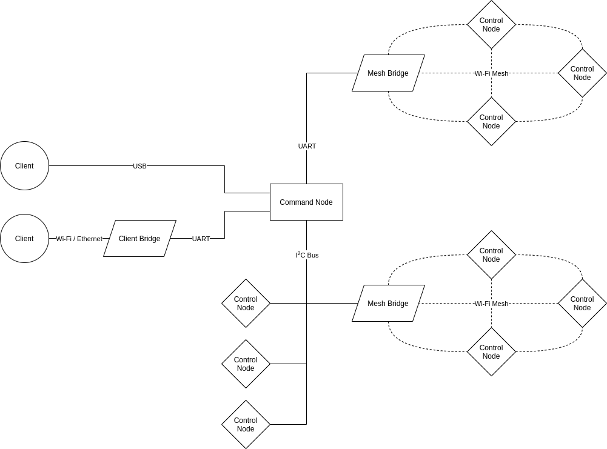

.. SPDX-FileCopyrightText: 2022 Sidings Media <contact@sidingsmedia.com>
.. SPDX-License-Identifier: CC-BY-SA-4.0

System Overview
===============

.. _rcArchitectureFig:

    Architecture of the railway controller system

:numref:`rcArchitectureFig` illustrates the overall architecture of the
railway controller network. There are 3 types of boards in the network,
the :term:`command node`, the :term:`control nodes<control node>` and
the :term:`bridges<bridge>`.  Only the :term:`command node` MUST be
present in all railway controller networks, all other nodes are OPTIONAL
although it should be noted, a network with only the :term:`command
node` wouldn't be very useful.

.. note::

    The I2C bus MUST support `arbitration using SDA`_ to allow for
    multiple controllers to be on the bus at once.

.. _`arbitration using SDA`: https://en.wikipedia.org/wiki/I%C2%B2C#Arbitration_using_SDA
