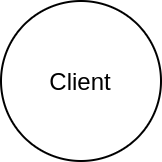
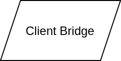
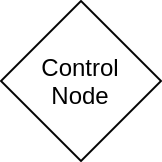
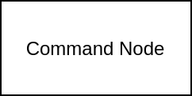
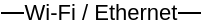

.. SPDX-FileCopyrightText: 2022 Sidings Media <contact@sidingsmedia.com>
.. SPDX-License-Identifier: CC-BY-SA-4.0

Introduction
============

This documentation is designed for those working on projects planning to
intergrate with the railway control system as well as those just wanting
to find out how the system works in more detail.

Our documentation is currently a work in progress. Please bear us while
we get it up to standard. Thanks for your patience.

The Sidings Media Team

Terminology
-----------

The key words "MUST", "MUST NOT", "REQUIRED", "SHALL", "SHALL
NOT", "SHOULD", "SHOULD NOT", "RECOMMENDED",  "MAY", and
"OPTIONAL" in this document are to be interpreted as described in
`RFC 2119`_.

Symbols
-------

Diagrams
^^^^^^^^

The following symbols are used in diagrams relating to the railway
control system.

.. note::
    The text inside a shape is used to provide more detail on it's
    purpose.

    
    Symbol for client

    Symbol for :term:`bridge`

    Symbol for :term:`control node`

    
    Symbol for :term:`command node`

    Symbol for board interconnects

.. _`RFC 2119`: https://www.rfc-editor.org/rfc/rfc2119.html
